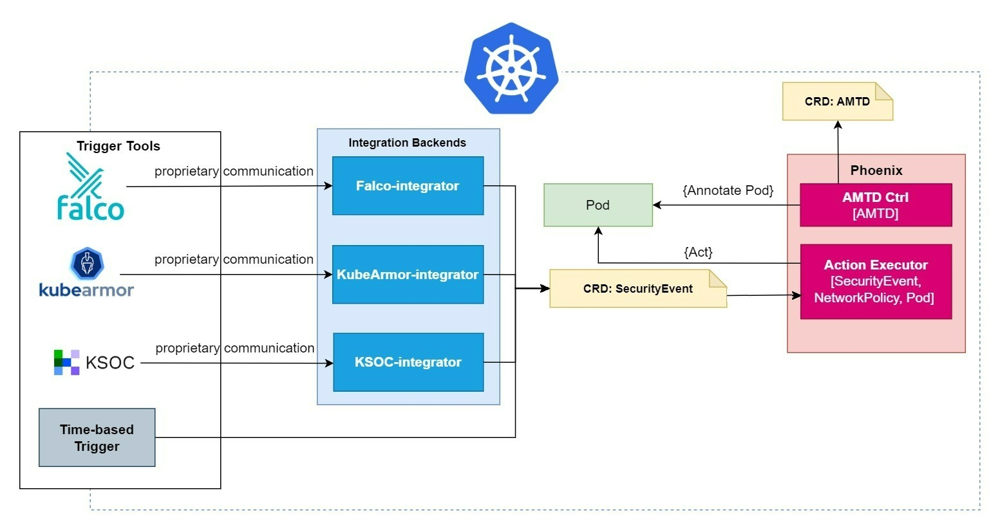

## Architecture

The diagram below illustrates the distinct components of Phoenix.

Phoenix is implemented as a Kubernetes Operator with its own specific Custom Resource Definitions (SecurityEvent and AdaptiveMovingTargetDefense). In general, Phoenix can be configured via AdaptiveMovingTargetDefense resources to watch specific resources in the cluster (as of now only pods) and, in the case of security threats, which are reported via SecurityEvent resources, execute specific actions to prevent attackers from exploiting vulnerabilities.

Earch SecurityEvent contains a collection of key-value pairs (e.g., threatLevel=warning, source=KSOC) that describe a specific threat and the identifier(s) of the threathend resource(s).
Phoenix can be configured with rule-action pairs where the rule part is a collection of key-value pairs (e.g., threatLevel=warning, source=KSOC) that are compared against the SecurityEvent key-value pairs. Phoenix executes the action that belongs to the best-matching rule-action pair (i.e., the most exact key-value match).
The collection of rule-action pairs are called `strategy` in AdaptiveMovingTargetDefense, this way, each AdaptiveMovingTargetDefense resource defines a set of resources to watch and a strategy based on which Phoenix should react.

The SecurityEvents typically originate from 3rd party security analytics tools (e.g., Falco, KubeArmor, KSOC) via Integration Backends. Since the 3rd party security analytics tools are independent from Phoenix, they do not know anything about SecurityEvents, neither necessarily need to run on Kubernetes, hence the creation of SecurityEvents is the responsibility of the Integration Backends. 
An Integration Backend is a webserver (as of now) that is prepared to receive notifications from a 3rd party security analytics tool via a webhook and to translate the threat information towards Phoenix via creating a SecurityEvent resource inside the cluster.
Each Integration Backend is specifically created for a concrete tool (e.g., Falco Backend, KSOC Backend) and runs inside the Kubernetes cluster, so integrating Phoenix with these tools requires no modification on their side; only the proper notification method and Integration Backend - as the receiving endpoint - need to be configured making the process transparent from their viewpoint.

Every time one would like to introduce a new 3rd party security analytics tool integration for Phoenix the only task is to implement a new Integration Backend that is capable of translating the threat notifications of that tool to SecurityEvents.

Phoenix itself is written in Go using the [Kubebuilder](https://book.kubebuilder.io/) framework and consists multiple controllers (AMTD, ActionExecutor) that ensure that, for any relevant object, the actual state of the world matches the desired state in the object. 

## Integration

### Configuring available 3rd party security analytics tools

If the Integration Backend exists for a specific tool the following steps are needed to set it up: i) deploying the specific backend and configure the tool.

#### Falco integration

##### 1. Deploying the Falco Integration Backend:

See the detailed documentation at https://github.com/r6security/phoenix/falco-ib

##### 2. Configuring Falco:

See the detailed documentation at https://github.com/falcosecurity/falco

#### Timer integration

The Timer-based Trigger is a special part of the architecture in the sense that it is nor a 3rd party tool neither a security analytics tool. Its main purpose is to provide SecurityEvents with specific contents in a periodic manner. 
The contents of the created SecurityEvent can be anything, so it can even mimic real 3rd party tool notifications towards Phoenix. 

Architecture-wise the specific aspect of the Timer-based Trigger is that the it can create SecurityEvents without an Integration Backend. The reason of this is that Timer-based Trigger is not an independent, standalone tool. Without Phoenix it has no purpose, however, for simplicity it made sense to have its own code base.

### Extending Phoenix 

The main architectural design principle for Phoenix is extendability. In the heart of Phoenix are the Actions that are executed in response to incoming threat detection, i.e. SecurityEvents. Consequently, when one would like to add new capabilities there are two approaches: 

#### 1. Extending the available set of 3rd party security analytics tools

To introduce the threat detection capabilites of a new 3rd party security analytics tool a new Integration Backend is needed, that is capable of translating the notifications of the specific tool and is able to create SecurityEvents inside the Kubernetes cluster.

Since the main integration point - or interface so to say - between the world and Phoenix is the SecurityEvent it is crucial that SecurityEvent CRDs of an Integration Backend be compatible with Phoenix, otherwise the integration breaks.

For this reason our goal is to keep SecurityEvent CRD backward compatible with consecutive releases and change it very carefully, thus enabling a loose coupling between the Integration Backend implementations and Phoenix.

#### 2. Extending the available set of Actions 

To introduce new behaviors in threat handling, new Actions can be created in Phoenix. Once the Action is available in a release, it can be simply assigned to any threat described in the `strategy` field of an AdaptiveMovingTargetDefense resource.

Currently, the only way to add an Action is by contributing to the source code of Phoenix via a pull request.

## Actions

As of now the following Actions are available in Phoenix:

### Delete

**Description:** Delete the Pod(s) listed in the `target` field of a SecurityEvent.

**Scope:** Pod

### Quarantine

**Description:** Block all ingress and engress traffic of the Pod(s) listed in the `target` field of a SecurityEvent.

**Scope:** Pod
